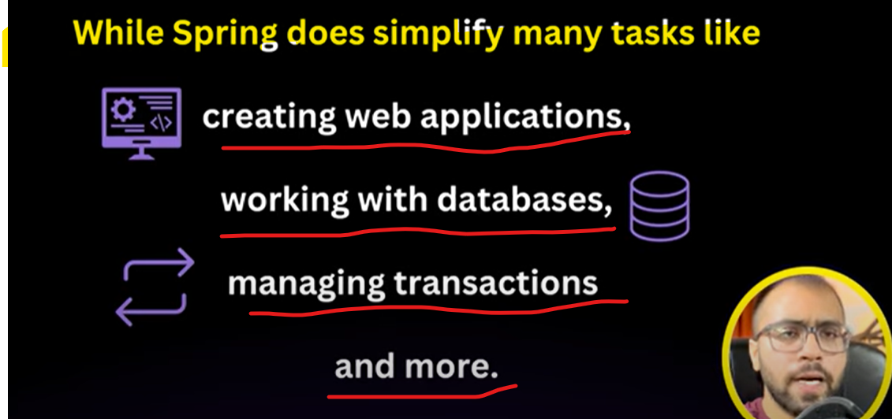
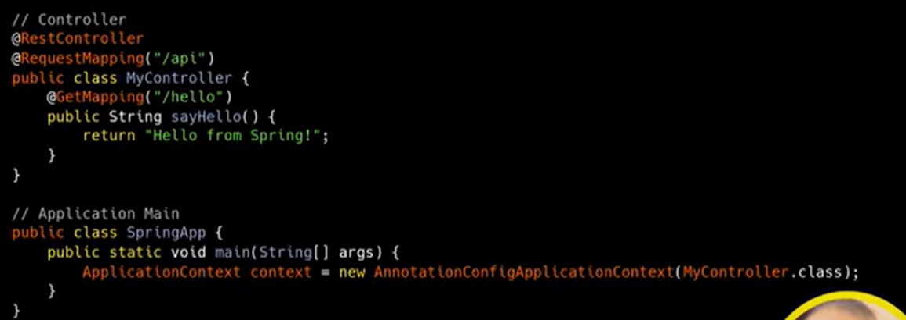
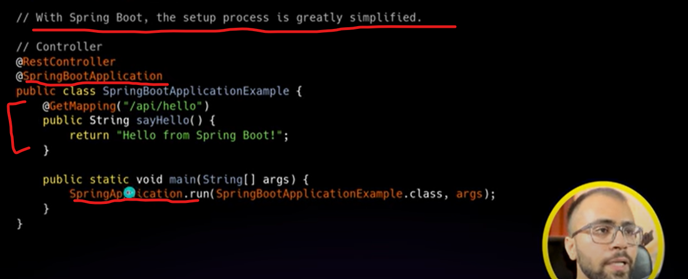

To create a Spring Project Easily Spring Boot came. Earlier to create a Spring Application we were doing many configurations
and manual works so spring Boot remove that all things. with help of spring boot within 3 to 4 line we can develop our
spring application and can deploy or ready to run.

Spring Boot provides 2 things
===============================

1. Auto-Configuration       - spring boot provides auto-configuration

2. Standalone Applications  - with help of spring boot we can create standalone application

Means- 
    you do not need any tomcat server where you are going to deploy your spring boot application jar. the reason is
    spring boot already having in-build tomcat server. which means that is self contained and independent from external
    environment. so no need to do any configuration on server simply take that jar and deploy. 
        earlier we were installing tomcat server doing some configuration and then we were deploying spring app.

=> We need to manually set up the Spring Application Context in the main Method.

In Spring Boot we use the @SpringBootApplication annotation on the main class. This single annotation replaces the need for
setting up a manual Spring Application Context.

We no longer need to explicitly create an application context using AnnotationConfigApplicationContext as 
Spring Boot Handles that behind the scene.

We use SpringApplication.run() to start the application and spring boot takes care of configuring the embedded web server and other necessary
components.

The @SpringBootApplication annotation alone brings in a lot of pre-configured features, including automatic component
scanning and embedded server configurations, which would have required more steps in a traditional spring set up.

Either Spring or SpringBoot they are generally uses a Beans. so, Beans is nothing just an objects. like how we do it manually
student st=new Student(). so, this Beans is re-usable. so, once Bean initialized then for entire code base application will
be using the same not going to re-initialized it.

In our older Spring we were configuring what all beans we do have and where we need to scan component but here
spring boot will do automatically with annotation @SpringBootApplication

** In Spring, we were creating an Application Context object but here In Spring Boot It Automatically happened.

** In Spring or Spring Boot code they needed Beans so they will go to Application Context and take that particular bean and inject it.
   so, Bean Is one time configured and all classes under same application can use it no need to use new keyword to instantiate object.
   so, Application Context will create a bean and it will give it to you when it's required.

jar we can run through cmd but war we need to deploy on an external server.
jar - java Archive
war - Web Application Archive

