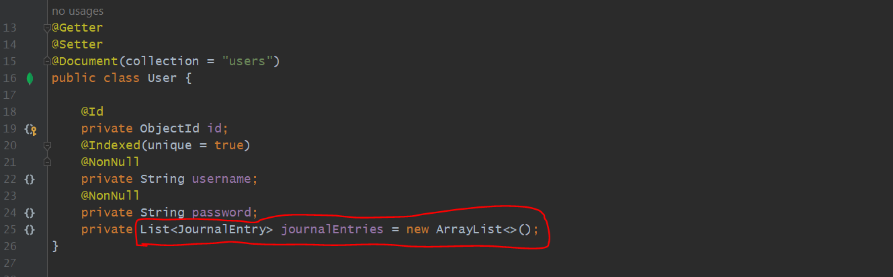
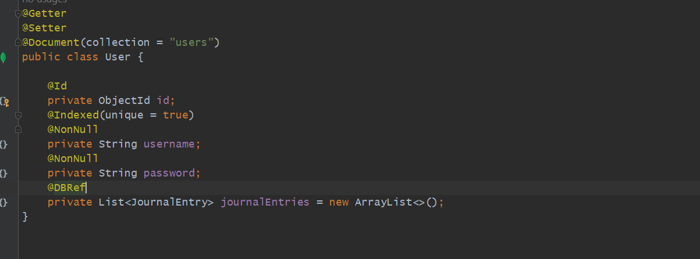
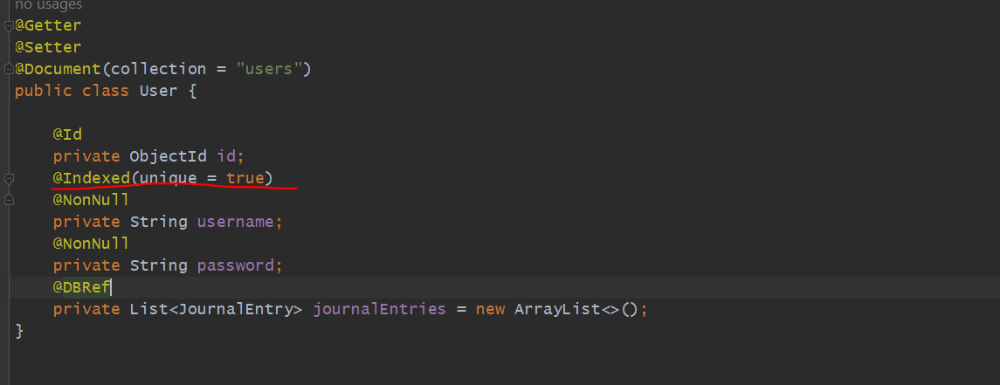
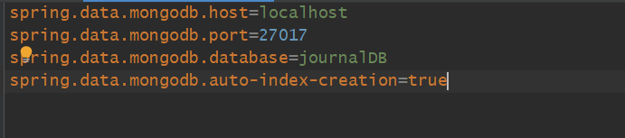

USECASE
========

We are going to Implement the Login Functionality. Every User can have many Journal Entries. let's assume 10 users then all 
user's corresponding journal entries will be there. All general entries will be associated with a user, obviously. 
suppose I am a user, I am entering my username and password then i could see only my journal entries not others.

This Authentication Process we are going to start from here...

so, our User will be look like this...

There will be a username, a password, and there will be a List of Journal Entries and here there will be Id for a User's Journal.

=> using Indexing on username field searching will get faster. so, all username will be unique here and it should be also.

=> Neither username and password should be null.

=> we want every user should have a particular journal entries. so, we want to map all journal entries to a particular users.

=> In DB In a user collection there will be multiple users there is a field called journalEntries. so journalEntries will contains
   a list of journalEntry. 

=> when one User get Initialized then there will be an empty JournalEntries list not null.

Is user collection and journalEntries collection get mapped by using this much configuration???
-----------------------------------------------------------------------------------------------

Is user collection and journalEntries collection get linked by this much configuration. 
so, we need to use one annotation @DBRef. which mean you are creating a Reference of JournalEntry inside a User.
which mean JournalEntries will keep a reference of a JournalEntry data. so it will looks like this below.

suppose username is ram, and a password and see in journalEntries has 2 reference, not kept a complete document like title..
but it kept a reference, a objectId of journalEntries of a particular document. so, we linked both. so for a User Ram there
are 2 journalEntries. so, the main use will be suppose In future we are deleting a User so from here we can fetch journalEntry
of a particular user then we can delete that entry as well. this work like a foreign keys. so here journalEntries field here
work like a reference and helping to make a link between these 2 collections.

so, parent child relationship got established here.

here we have written @Indexed(unique=true) but automatically won't create to create automatically we need to set properties.
by default spring won't do Indexing we have to configure in properties file.

Create UserController
=====================

