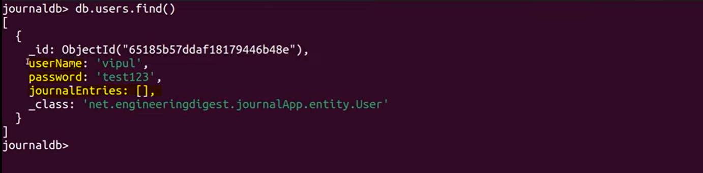
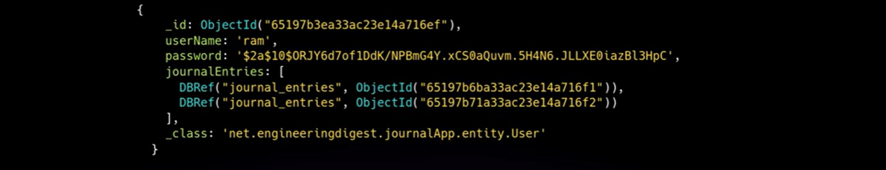
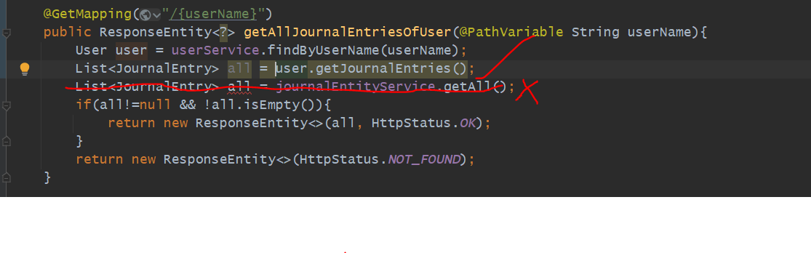
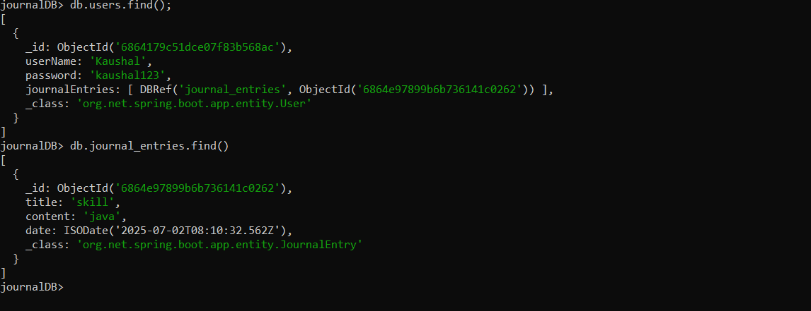
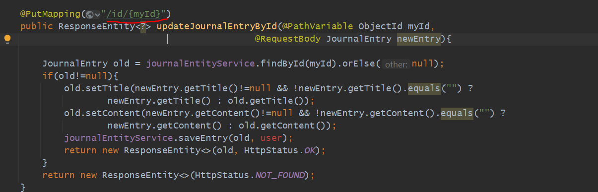
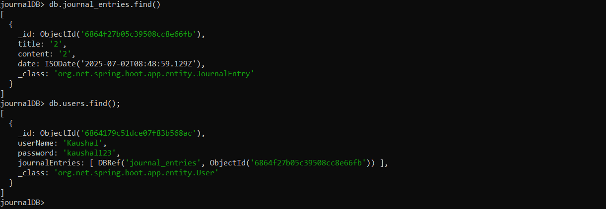

USECASE
========

We are going to Implement the Login Functionality. Every User can have many Journal Entries. let's assume 10 users then all 
user's corresponding journal entries will be there. All general entries will be associated with a user, obviously. 
suppose I am a user, I am entering my username and password then i could see only my journal entries not others.

This Authentication Process we are going to start from here...

so, our User will be look like this...

There will be a username, a password, and there will be a List of Journal Entries and here there will be Id for a User's Journal.

=> using Indexing on username field searching will get faster. so, all username will be unique here and it should be also.

=> Neither username and password should be null.

=> we want every user should have a particular journal entries. so, we want to map all journal entries to a particular users.

=> In DB In a user collection there will be multiple users there is a field called journalEntries. so journalEntries will contains
   a list of journalEntry. 

=> when one User get Initialized then there will be an empty JournalEntries list not null.

Is user collection and journalEntries collection get mapped by using this much configuration???
-----------------------------------------------------------------------------------------------

Is user collection and journalEntries collection get linked by this much configuration. 
so, we need to use one annotation @DBRef. which mean you are creating a Reference of JournalEntry inside a User.
which mean JournalEntries will keep a reference of a JournalEntry data. so it will looks like this below.

suppose username is ram, and a password and see in journalEntries has 2 reference, not kept a complete document like title..
but it kept a reference, a objectId of journalEntries of a particular document. so, we linked both. so for a User Ram there
are 2 journalEntries. so, the main use will be suppose In future we are deleting a User so from here we can fetch journalEntry
of a particular user then we can delete that entry as well. this work like a foreign keys. so here journalEntries field here
work like a reference and helping to make a link between these 2 collections.

so, parent child relationship got established here.

here we have written @Indexed(unique=true) but automatically won't create to create automatically we need to set properties.
by default spring won't do Indexing we have to configure in properties file.

UserController created let's do testing through postman.

we can see we have created a user with userName kaushal8707.as we have mentioned userName Indexed unique
   @Indexed(unique = true)
   @NonNull
   private String userName;

so while trying to create one more user getting exception

we are getting a duplicate key exception.

now we can't change the username. for this functionality we can't change the username. so now if i send
a request with name manu it won't create bcz there are no user with that name. 
now we have created a UserController which will create a user, get a user list and update a user.

let's try for update PUT Method
-------------------------------

so now all 3 end points tested for a user endpoint

Important->
->
->->
->->->

Usecase of @DBRef & @Indexed
============================

Till now there is no link between Journal Entry and User.

so, when we do a get call for a journal entry then what all entries are there i db it will fetch. But now what we will do for
a particular user's entry we will fetch. similarly while we do entry in db then we mentioned for which user we are doing
journal entries. so we will perform all operations for a particular user.

so now here by userName we are able to find the User like below. here always journalEntries will be an empty list bcz we have initialized
using new ArrayList<>();

Testing----->
---------------

** In Entity class we need @NoArgConstructor which is needed during de-serialization means converting from JSON to POJO.
In User we have one user- kaushal

step 1-
go to postman and do 1 entry in journal for a user-kaushal

Now we have tested below 2 API's and one more also get By ObjectId bcz no change req now done
---------------------------------------------------------------------------------------------

let's try for DELETE Journal Entry
===================================

let's see DB first

now for a user kaushal there is one journal entry whose id is : 6864e97899b6b736141c0262 let's try to delete

conclusion: deleted entries from journal entry table but still there is a reference of a journal entries in a user table.
            which means automatically not got deleted. this is called cascade deleted which doesn't happened here in mongodb.
            let's do it now.

now here updated user got saved not new user bcz in that id will also be there. then on same id if we run save()  then will
get updated. so here user saved and journal entry got deleted. let's try run and test.

=> let's create some entry then try deleting

DELETE : localhost:8080/journal/id/Kaushal/6864f25005c39508cc8e66fa

=> that entry got deleted whose title was 2.

            
Now let's see UPDATE By ID
============================

old api enpoint

after code change:-

PUT : localhost:8080/journal/id/Kaushal/6864f27b05c39508cc8e66fb

Now here we made a relation between user and journal entries...like while adding in journal entries it adding in user also...while deleting
from journal entries its deleting from user as well.

