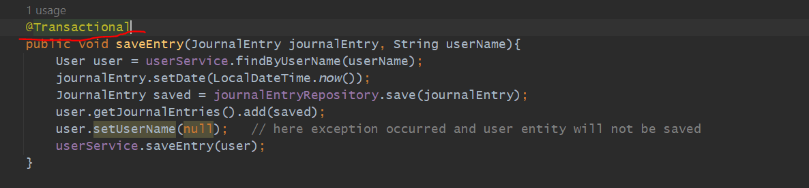
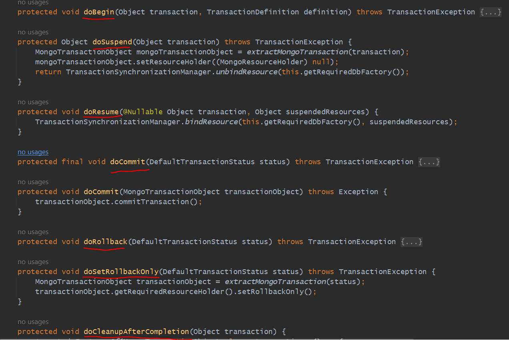

Transaction
============

Earlier we saw In JournalEntryController there are some api. like while we are inserting any entry then in a particular user it should 
save. similarly
while we are deleting an entry then from a particular user also it should be deleted.

we saw while we were saving at 2 places we were saving one in a user and another in a journal_entries. similarly while we delete any 
journal entry it should be deleted from journal_entry and also from a user which contain this entry.

But still there is an issues in createEntry and deleteEntry.

so suppose In journal entry it got saved but in user it is not got saved due to some reason then what will happen.
so In journal entry it saved but not associated with any user. because we mentioned username and password should not be null.

so deliberately before saving to user let's set username as null.

so, In journal entries it came but in user it is not saved. we are getting NullPointerException.

Imp (T R A N S A C T I O N S)
-----------------------------

we should make this method Transaction which mean if everything went well then it should save if any exception occurred then
everything should be failed and process should be rollback. 

Now This annotation will tell to SPRING inside this method everything should be treat like a single operation. 
means if any error occurred in that case if any operation got success we need to rollback.

So, On Each method which is annotated with @Transactional what SPRING Boot will do is every method corresponding 
it will create a TransactionContext. TransactionContext means will create a container where these methods related
all db operations will be there, and they treat like a single operation if anything got failed then all got rollback. 
here, we are achieving the Atomicity. atomicity means either all succeed or all failed.
    But Here ISOLATION also getting achieve, suppose 2 requests come concurrently so suppose 2 user user1 and user2 hit this API 
at same time In this case Spring Boot will create a 2 TransactionContext container in corresponding of 2 users.In user1, user1
operation will be store and in user2, user2 operation will be store. so, both will be isolated.

Who Is going to Managing/Handling Transaction like start a transaction / Rollback a Transaction
=================================================================================================

There is a Manager called PlatformTransactionManager this is an Interface, who is going to do all work like commit, rollback...
If everything went well then will do commit if anything get failed then rollback. 
so, There will be an Implementation for It MongoTransactionManager. within that if you can see

so, we saw PlatformTransactionManager Interface and the class who is implementing this interface is MongoTransactionManager. actually
MongoTransactionManager class only doing work to do a commit and rollback. 

so, we have to create a Bean to say PlatformTransactionManager which is an Interface and there Implementation is MongoTransactionManager.

MongoDatabaseFactory will help us to make a db connection. what all things we are doing in db that is with the help of MongoDatabaseFactory only.

with the help of MongoDatabaseFactory you can make a connection. 

let's do the Testing
--------------------

first let's see in db what all journal entries and user data looks like

so, no changes in database.

Just throw the Exception in Catch block otherwise How SpringBoot will get to know something gone wrong. bcz in console error not showing now...

