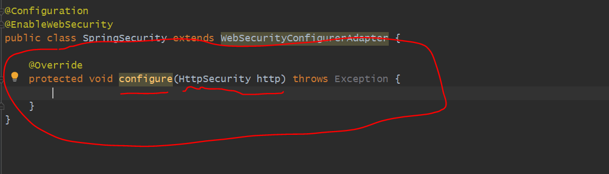
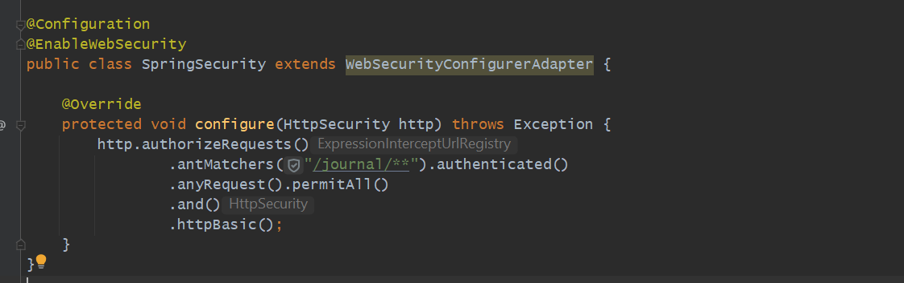
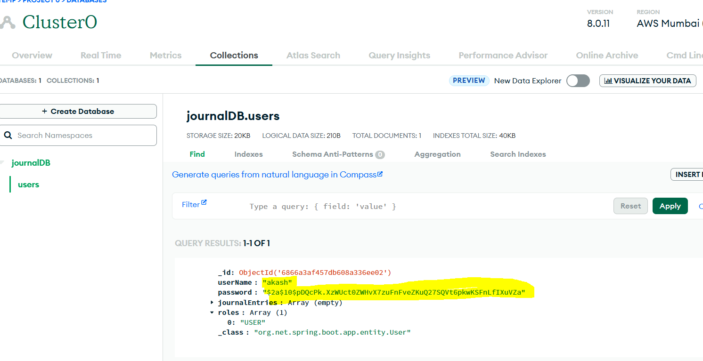

Spring Basic Security
========================
===========================

Authentication means to whom we allow to access application and to whom we should not. so, we have an API
are you able to access that API?? that is authentication. ex username, email password or 2 MFA.

Authorization means If you do have an Access then what all resources can you access. for example
do you have a admin role or read role.

=> To Handle Authentication & Authorization SPRING Security comes into picture.

What is mean of Basic Authentication ??
========================================

<encoded-string>
------------------

let's do Testing for our Controller
====================================

after adding dependencies now all endpoints get secured.

we have added username and pwd in Auth but If we open Header Postman automatically added in Header Authorization
as key and value as a Basic <encoded-string>

Key- Authorization
Value- Basic <encoded username:password>

Basic dXNlcjo0OGQwNTNiZi1iNmJiLTQxNjgtOTZmYi1hNzVlZjA4MTI1ZWM=
Basic <encoded-string>    i.e username:password  encoded using Base64

https://www.base64decode.org/

so, when we added in Authorization It automatically went to Header.

summary
========
now all the end-points got secured but using only one password we do have. so we need customization.

let's create a Configuration class
==================================

we are creating a class called SecurityConfig. why we are creating is now all our endpoints got secured
but, we want to secure only few endpoints and which all endpoints we want to secure matter. now we have only
one default user that also need changes.
SecurityConfig extending WebSecurityConfigurerAdapter. 

we have one annotation @EnableWebSecurity what is meaning of It??
-------------------------------------------------------------------

SecurityConfig extending WebSecurityConfigurerAdapter what is meaning of It??
------------------------------------------------------------------------------

HttpSecurity http
------------------
using instance of HttpSecurity we can apply all filters like which all requests we want to authenticate
which all requests we do not want to authenticate. 

Basic Authentication is Stateless What is Meaning for It??
==========================================================

I am sending a encoded username and password in Header, It went to server, and we got the response now
If I am sending second time requests then again same things i need to do. so, If I am sending 100 times
requests then 100 times i need to send username and password. stateless means second request do not know 
what was the first request. so all treat differently.

If Basic Authentication is stateless here then what the use of Logout here
==========================================================================

+ Some Applications do mix Basic Authentication with session management for various reasons.
+ This isn't standard behavior and requires additional setup and logic.
+ In such scenarios, once the user's credentials are verified via Basic Authentication, a session might
  be established, and the client is provided a session cookies. 
+ This way, the client won't need to send the Authorization header with every request, and the server
  can rely on the session cookie to identify the authenticated user.

When you login with Spring Security, It manages your authentication across multiple requests, despite HTTP being stateless
--------------------------------------------------------------------------------------------------------------------------

Authenticate Users Based on their Credentials stored in a Mongo Database
========================================================================

now any user can see any other user's journal entry. we want user can see only their own journal entries after authenticated successfully

Now let's delete old entries from AWS. let's create 2 users and for each users let's create 2 entries.

Now username and password we are not going to pass through URI we will give it inside a Header.

USE-CASE
========

A User can have roles like user, admin....

UserDetailsService Implementation to fetch user details

Inside Spring Security there is an Interface called UserDetailsService.

we have to create an Implementation class of a UserDetailsService.

we saw when we started our server then in Mongodb created a user collection in AWS bcz it has to do Indexing.

Some Modifications in User Controller
=====================================

as of now we are saving username and password as it is which is wrong.

BCryptEncoder we can use to hash the password

https://bcrypt-generator.com/

for user we have not added security if u can see...

*** Spring Security Manages a Session so we are going to disable it.

*** Now User is created and that endpoint is Public so anyone can access it.

Now Put Mapping to Update the User (Imp)
========================================

Obviously this should be Authenticated. now there is one problem create user we have to make it public so anyone can access it.
but there would be 2 more endpoint one for update and another for delete.

=> And that should only be accessible once user get loggedIn or user get authenticated.

create one Public controller and move create endpoint there. bcz our public control will be un-authenticated.

** => for /user we have to authenticate

Important
-----------

If username not pass here then from where it will take to update user. 

POST: localhost:8080/public/create-user

Now we Authenticate this PUT / update method

Now with which username and password we hit this endpoint automatically it will come here after authenticate no need to pass username
and password.so, How it will come, It will come using SecurityContextHolder.

*** When Any User get Authenticated then there details will get stored in SecurityContextHolder.

so, no need to give pwd bcz till here it will reach only If he gets authenticated.

=> so user send username and pwd converted into hash. 

after that it will get checked also the hash pwd we have and the hash pwd value from db matched or not. if matched then authenticated
otw forbidden. so spring security will handle all matching code here.

Testing
==========
In db we have a registered user akash & aks
let's pass that in our Basic Auth... let's give in body akash1 & aks1 and try to update

If I try again with old uname & pwd

DELETE User
============

