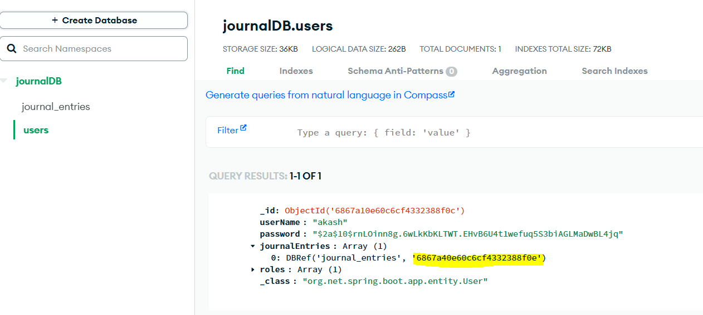

How to Test this App ?? Auth
----------------------------

First create a Uer using 

now user got registered, each entries associated with a user. 
so, User need to authenticated to perform operations on journal entries like add entry/delete entry by id/ update entry by id/
get all entries.
so, while performing operations you have to authenticated and add Basic Auth Credentials 
------------------------------------------------------------------------------------

we have a postman collection- journal-spring-boot-mastery.postman_collection with mentioned steps just import and test

Earlier we have enabled the Authorization in UserController so, now we will Authorize the JournalController.

so, here we are sending username in path variable and password we are not sending it. so AUth not yet enabled any user can come and
see any user journal entry.

Use-case
--------

User1 can see only their own entry ..same like user 2. so they can do after login.

unauthorized bcz we have added the authentication on journal endpoint.

Not found that is right bcz for user-akash1 there is no journal entry.

getJournalEntryById
==========================

earlier code

Imp - you have to make sure the id which you are passing should be from your journal entry id only not others please make sure
so let's do changes.

If myId(passed userid) is not in journal entries list which mean you are passing wrong value id.

How to Test
==========

first create user

get all entries- not found bcz no entries

create entries with authorization data

getJournalEntryById (id-> journal entry object id which is ref in user journal entry as well same)

       bcz user should only see their own entries

so first add user-> play with journal entries controller after adding auth credentials

deleteJournalEntryById
========================

let's delete office title one

updateJournalEntryById
=======================

earlier data

We have added Auth to User and JournalEntry Controller

