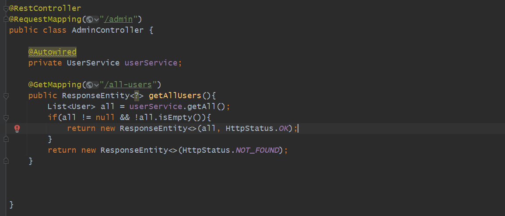
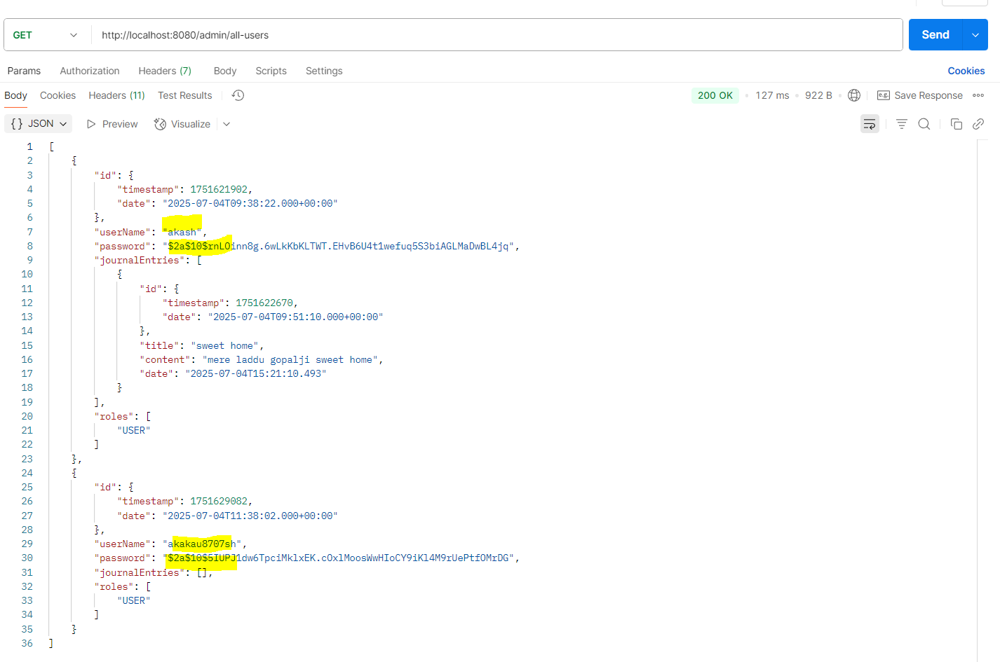
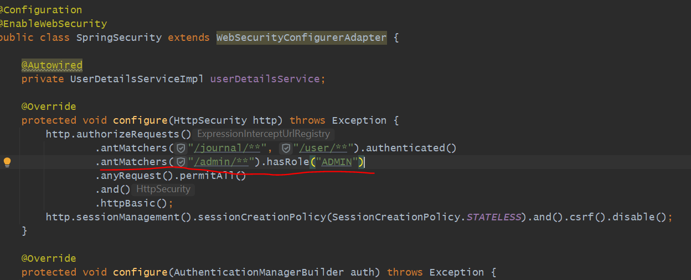
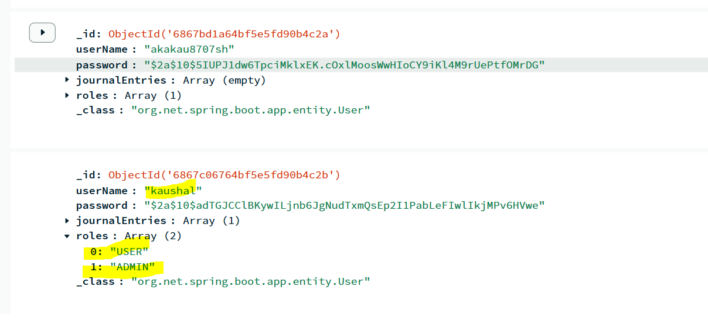
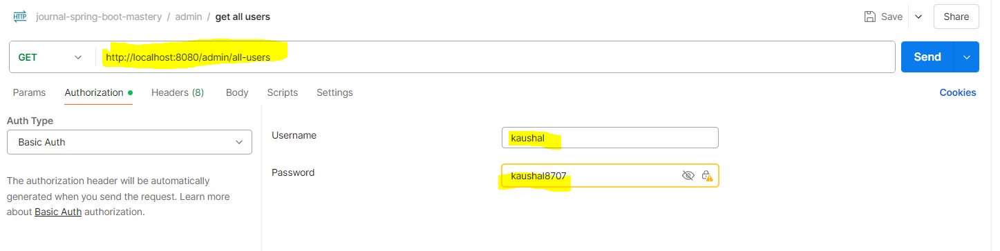
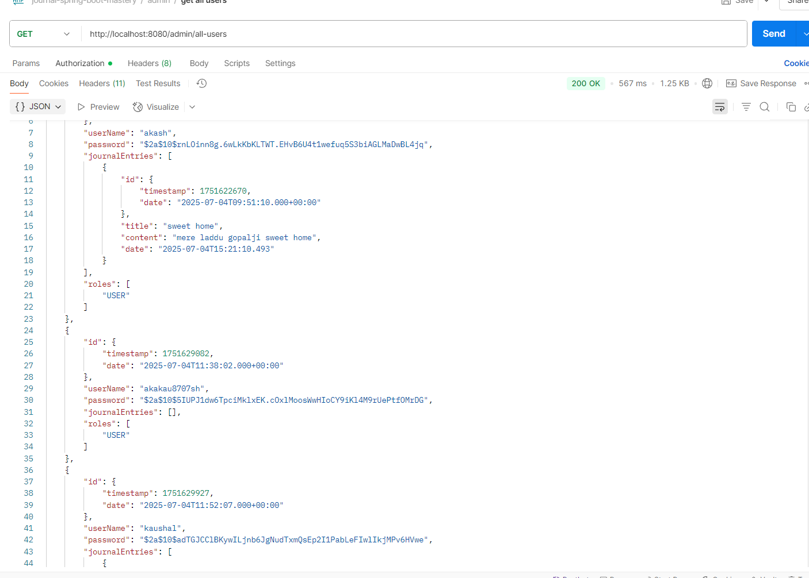
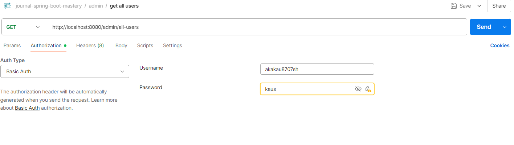
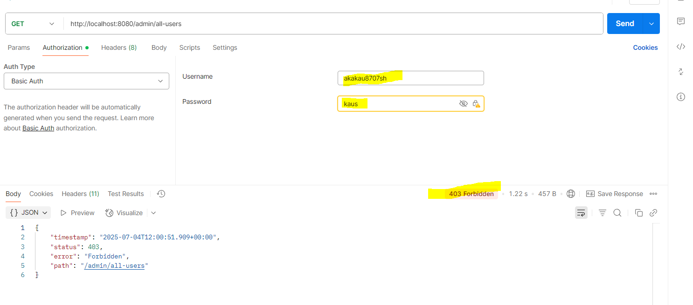

Role Based Authentication
=========================

let's create an AdminController. let's create an end-point which will fetch all users list from the database.

1st one with 1 journal entries but 2nd user have no journal entries.

*** admin API now only be Authenticate with that users only whose role is ADMIN.
*** now user role can't access admin api.

we have given 2 Roles to User kaushal/kaushal8707   - USER+ADMIN
now kaushal can be able to access all-users endpoint but akash not let's test

