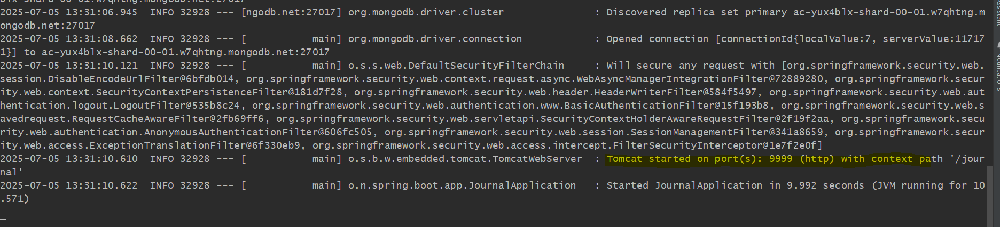

so we can see application port started on 8081 what we mentioned in application.yml

If .properties and .yml both available which one will get preference first
---------------------------------------------------------------------------

*** application.properties get preference first

If .properties and .yml and command-line argument all 3 available which one will get preference first
----------------------------------------------------------------------------------------------------

PS C:\Users\e162554\OneDrive - Mastercard\Interview\Spring-Boot-Mastery-Bootcamp\target> 
                    
    java -jar .\journalApplication-1.0-SNAPSHOT.jar --server.port=9999

*** First Preference command-line-argument
*** Second Preference application.properties
*** Third Preference application.yml

Even we can pass argument through Spring Boot Run Configuration as well
=======================================================================

so, this is the another way we can pass config parameters what is in .properties or .yml

