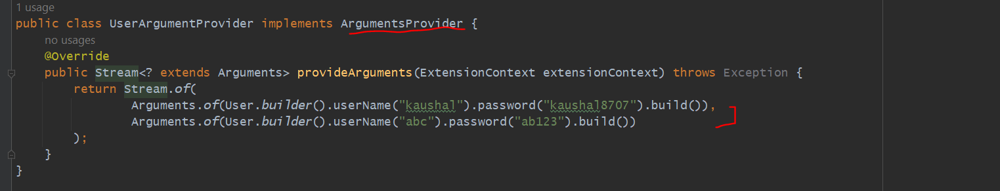

TDD - Test Driven Development
-----------------------------

Writing a test cases along with developed code.

dependencies-

<scope>test</scope>

as it is needed during testing not to creating a jar..
If we go inside spring-boot-starter-test i can have jupiter dependencies.

It's already Included so no need to do anything.

SCENARIOS - 1
=============

suppose we need to write a test - case for a UserService
--------------------------------------------------------

In Database

here we got null pointer exception bcz UserRepository is Null here.

imp->
  This is null because Spring Application context not yet started. so when our application running
then only bean will create and, we are Injecting so null pointer exception. so, To start
Spring Application Context we need to annotate our test class with annotation @SpringBootTest

Parameterized Test
------------------

SCENARIOS - 2 @CsvSource - (Passing Multiple values as a Parameters not a static value)
=======================================================================================

just like a loop with multiple values

SCENARIOS - 3 @ValueSource - (Passing Multiple values as a Parameters not a static value)
=========================================================================================

SCENARIOS - 4 @ArgumentSource / Custom Source - (Passing Multiple values as a Parameters not a static value)
============================================================================================================

ArgumentSource Test - String Data
----------------------------------

ArgumentSource Test - User Object Data
--------------------------------------

