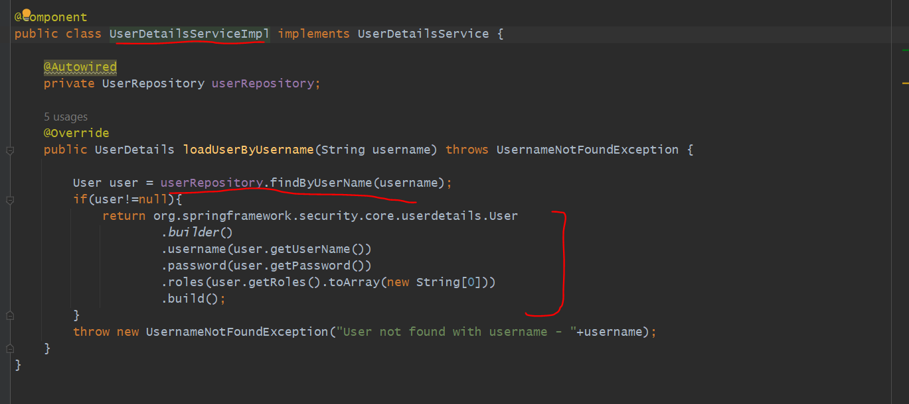
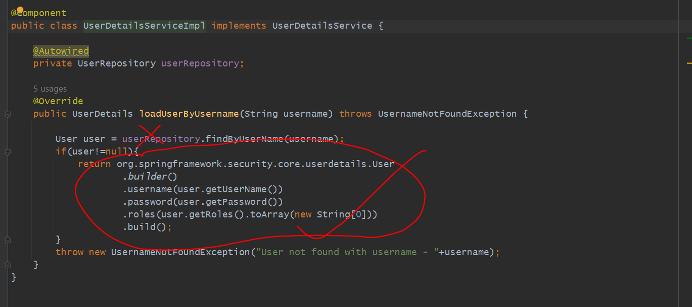
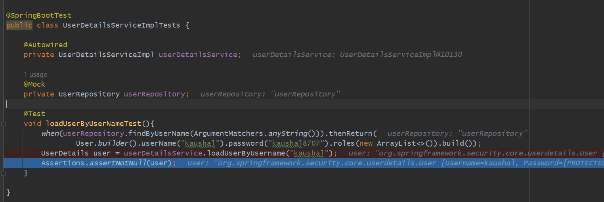
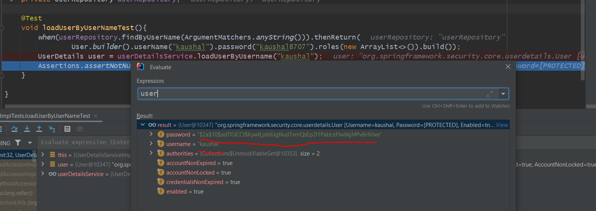
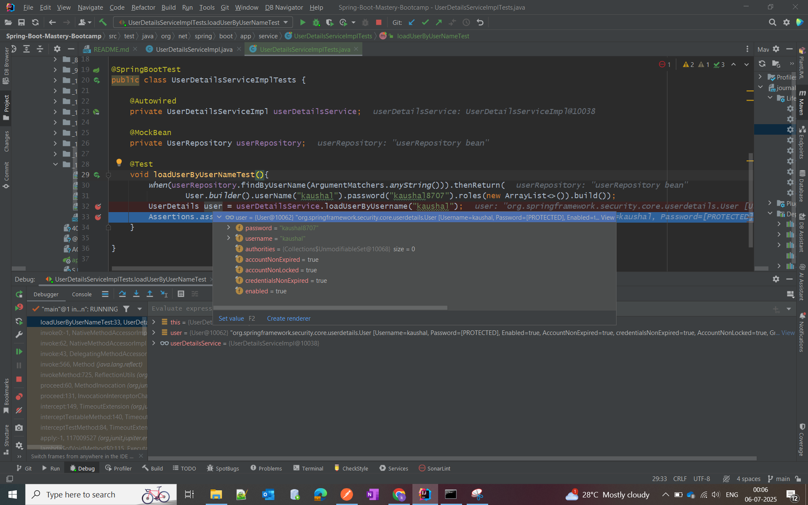
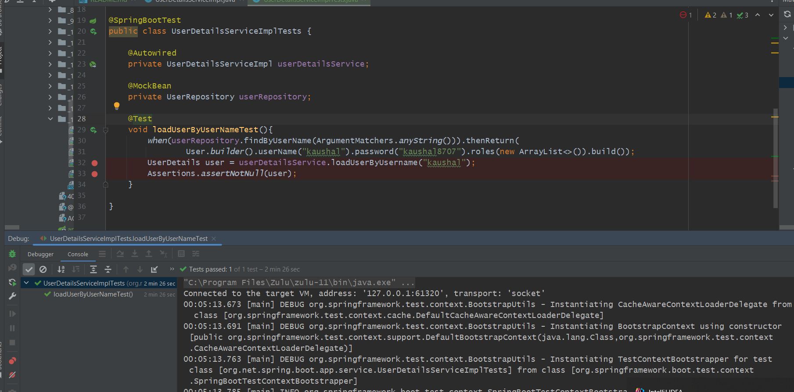

Earlier we saw during Junit Testing we are Autowired the Injected Beans. 

=> If we @Autowired then SpringApplicationContext will get started then things will get time like to establish a
database connection, all components will get started...so It takes time 
    If you want to proceed faster and If you don't want to multiple time do Autowiring, implementing and
Injecting beans and all.....then in that case you can do Mocking. which means Instead of using actual dependencies you
can use mocking objects. 

What is Mocking & How It Works ??
=================================

suppose we have a service called UserDetailsServiceImpl and we have to test method - loadUserByUsername()
and you can see we are using userRepository so, it will hit database based on username it will find user and give it back to us.
so it will take time to build connection and load all components. so, we don't want to use autowired userRepository
we just want to mock it. 

because we just want to test the marked user details not the userRepository call. bcz already we have tested that part like if
we are passing username then it was giving User object from database. so we can mock userRepository. which mean we are making
a fake repository so we can tell when ever we call findByUserName() give us a dummy object. so that i can test rest of things
and no need to call actual db bcz that will take time and i do not have much time. so this is called
mocking and we can achieve using Mockito.

Use of @MockBean
================

we can see here what we got is not the mocked one it's from the mongo database.bcz here we have used Mock but, we have to use MockBean.
so, @Mock and @MockBean are 2 different annotations, and they behave differently. 
see what is happening.........

so, our UserDetailsServiceImpl bean created in Application Context and, we have used @Mock annotation. so, there is no relationship or 
no use of Mock and Spring Application Context. But we need, what we need instead of actual repository our mock repository should run.

for that we have to annotate @MockBean instead of @Mock so that when UserDetailsServiceImpl get initialized then is MockBean get Injected with.

