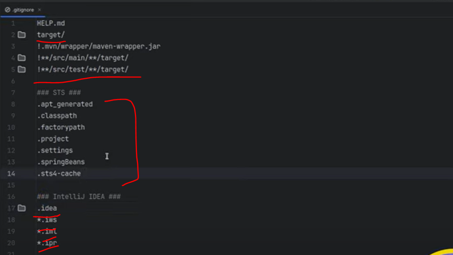
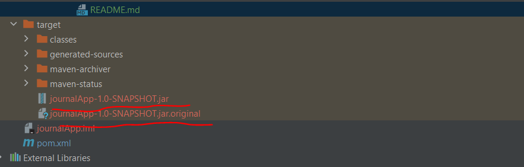
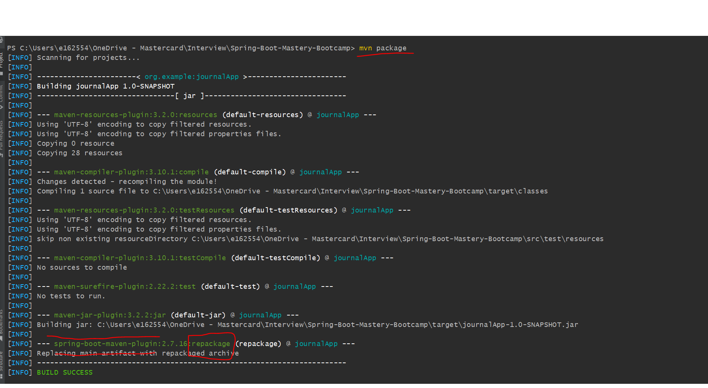

.idea - this file related to intellij configuration not related to spring boot

.mvn - this is for maven wrapper. If you use maven wrapper then this jar will get used.

.gitignore - If this is your git project then while committing which all files you want to ignore.

   

=> maven-compiler-plugin will be available in spring-boot-starter-parent for that we specified 
    java. version in our <properties> tag.
=> so when maven compile and create a bytecode should be compaitable with java 1.8.

pom.xml (project object model.xml)
-------------------------------------

- this file contained all information about our projects.

- how it will build our projects.

- what all external libraries our project is going to use all that kind of information stored in pom.xml.

- <parent>   
    <artifactId> spring-boot-starter-parent </artifactId>
  </parent>

  - we have added only one dependency in spring initializer spring-boot-starter-web
  - then he has added <parent> dependency..
  - If you add <parent> spring-boot-starter-parent</parent> then our project inherit few required
  - dependencies and we have given the version 2.7.15 which mean our spring boot project version
  - is currently 2.7.15. so if you define parent then our project will inherit all required plugins,
  - dependencies and properties.

imp (what is re-packaging) ..........???
==========

   <build>
        <plugins>
            <plugin>
                <groupId>org.springframework.boot</groupId>
                <artifactId>spring-boot-maven-plugin</artifactId>
            </plugin>
        </plugins>
    </build>

Explanation (Important - Re-Packaging)
---------------

while mvn package

what this spring-boot-maven-plugin is do??
what is the meaning for
    --- spring-boot-maven-plugin:2.7.16:repackage (repackage) @ journalApp ---
    [INFO] Replacing main artifact with repackaged archive

------------>
while we do mvn package or mvn wrapper package then inside a target folder 2 jar will be created
one with .jar and another with jar.original.

** with the help of java -jar journalApp-1.0-SNAPSHOT.jar our spring boot app will up and start running.

** journalApp-1.0-SNAPSHOT.jar is the different jar we called a FAT jar. In this jar not only
   consist compiled code along with compiled code all dependencies as well which we need to run
   this spring boot application.

** you can see we have one more jar - journalApp-1.0-SNAPSHOT.jar.original
   In original we can have only compiled codes. but in our jar all plugins, dependencies and properties everything will be.
   so no external things we need only go and run java -jar journalApp-1.0-SNAPSHOT.jar it start running.
   that's the reason .jar is 17 mb and original is 17kb.

** this jar we called self - contained jar (journalApp-1.0-SNAPSHOT.jar) nothing is needed.
   that's the reason you do not need any external tomcat server. embedded server is there.
   
imp
=====

what is re-packaging in maven
------------------------------

one thing you saw while we do mvn package then .jar and original got created this is called
re-packaging and this is possible because of only this plugin - spring-boot-maven-plugin.

This plugin will create first a .original jar. and again it will take .original bytecode jar 
and do repackage with all dependencies and the old one give name jar.original and the new jar
created which will be a .jar(fat jar) .

