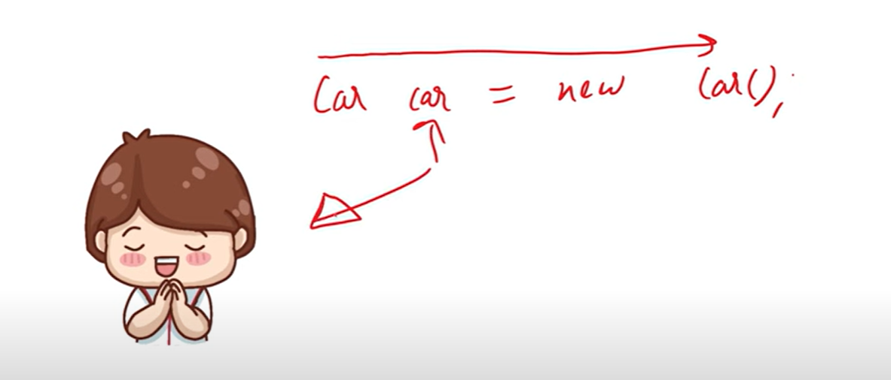
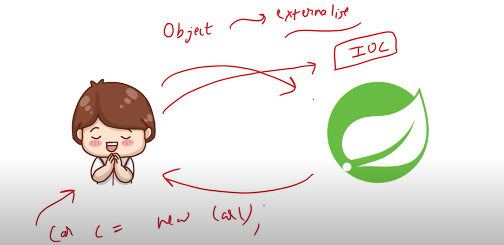
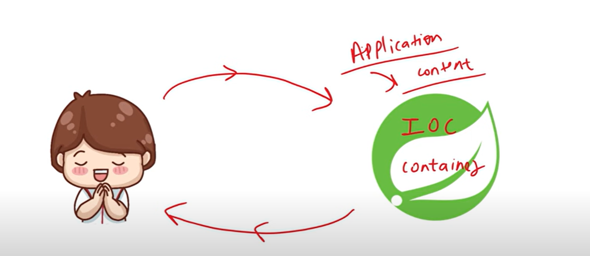
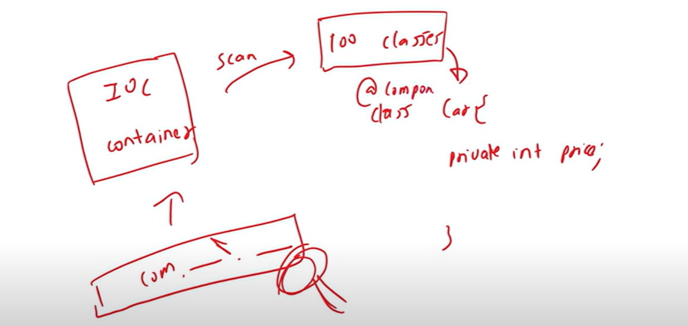
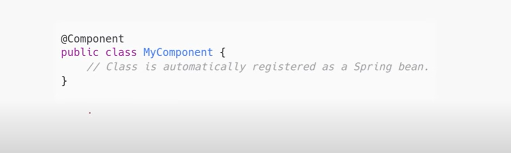
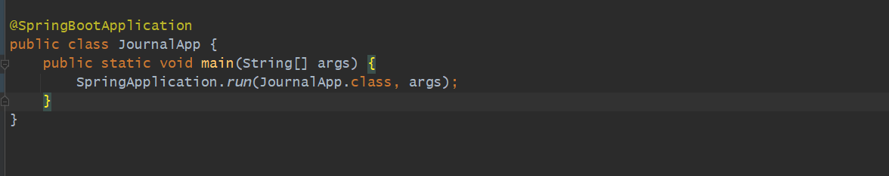
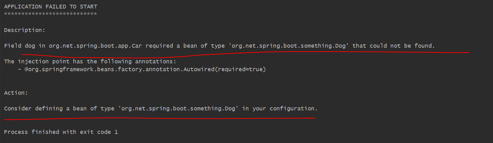
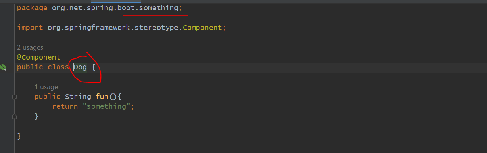
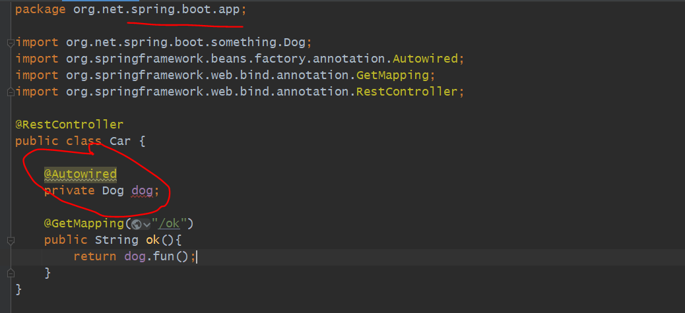
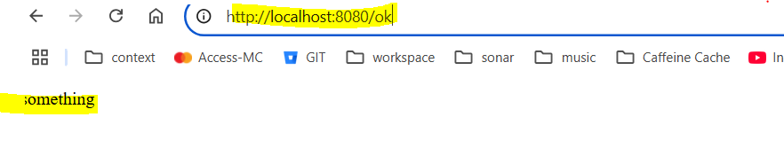

@SpringBootApplication Internal Working | IOC Container & Dependency Injection in Spring Boot
=============================================================================================

Spring Boot Core Concept
-------------------------

earlier If we have a class and we want to create an instance. we were creating an object using new keyword . 
But Spring provides a functionality so now we are going and ask to Spring to create an Object and give it to us.

Now we are externalizing the object creation. earlier we were creating now spring is do it behalf of us.
Now we move the control from developer to Spring that's called Inversion of Control.

Now we will go to Spring IOC container i.e spring and IOC will give an object to us. 

IOC Container is a part of SPRING. 

Difference Between IOC Container and Application Context
========================================================

Application Context is a way to Implement IOC Container. We achieve IOC Container with the help of Application Context.

ApplicationContext is a way to achieve IOC Container.

How IOC Container keeps the Beans inside ??
============================================

Actually IOC container scans the package which we defined. If we have 100 classes Is IOC container keep all 100 classes
with them Answer is - No.  

IOC container will see Is class is annotated with @Component annotation. If yes then he will kept that class as a Bean.

Class is Automatically registered as a Spring Bean If It annotated with @Component.

Bean -> In Spring Language Object is called Bean. write @Component with class it is called Bean.

@SpringBootApplication Internal Working
=======================================

In our Spring Boot Application this is the main Entry Point. this annotation we put in a main method.

this annotation will perform 3 tasks:

this @SpringBootApplication annotation perform work for 3 annotations. 

a. ComponentScan: Either you can say IOC container or ApplicationContext. it will look for a classes which is annotated 
                  with @Component. It will scan the Beans so later while user need IOC container can provide. it will look into
                  the base package we defined and where main method defined. 

   
   
   
   
   
   
   ** let's put both class into a same package.

   http://localhost:8080/ok

   

   @RestController  is a specialized version of a Component. @RestController also creates a Bean. because @RestController consist of @Controller + @ResponseBody. @Controller consist of
   @Component. @Controller is a stereotype annotation. Car class we annotated with @RestController so this will also register as bean.

   @Autowired 
   private Dog dog;  -> this is called Dependency Injection. 
   Now our Car is depending on a Dog class. now we are asking spring to give a dog object.
   Now our Car is depending on a Dog class and we have injected dog into a Car class using @Autowired called Filled Injection.

   
b. @EnableAutoConfiguration: It will do Configuration automatically. now you want to run mongodb. you are just adding the
                             mongodb dependency in pom.xml and in .properties file added server, port and username/password.
                             springboot will do everything by itself. so no need to do anything like creating a connection and all.
                             It will do Configuration automatically.

c. @Configuration:  @Configuration annotation if you are writing on a class then that class will provide some configuration. generally
                    @Configuration annotation get using with an annotation that annotation is called @Bean. we can create a Bean
                    using bean annotation @Bean as well. @Bean annotation we never apply on a class we applied only on a function/method.
                    while we define @Configuration on any class then we can create a Bean Inside that class with the help of Function. 
                    
   
   
  