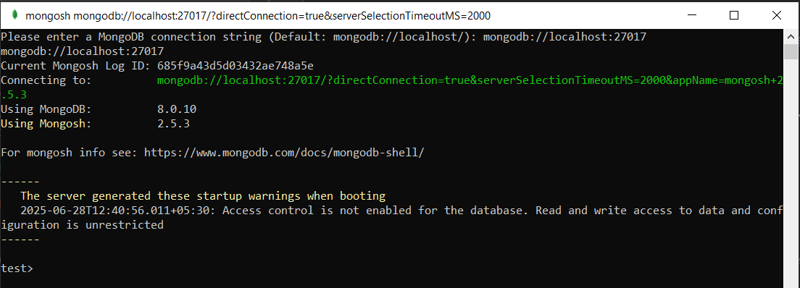
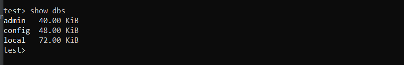
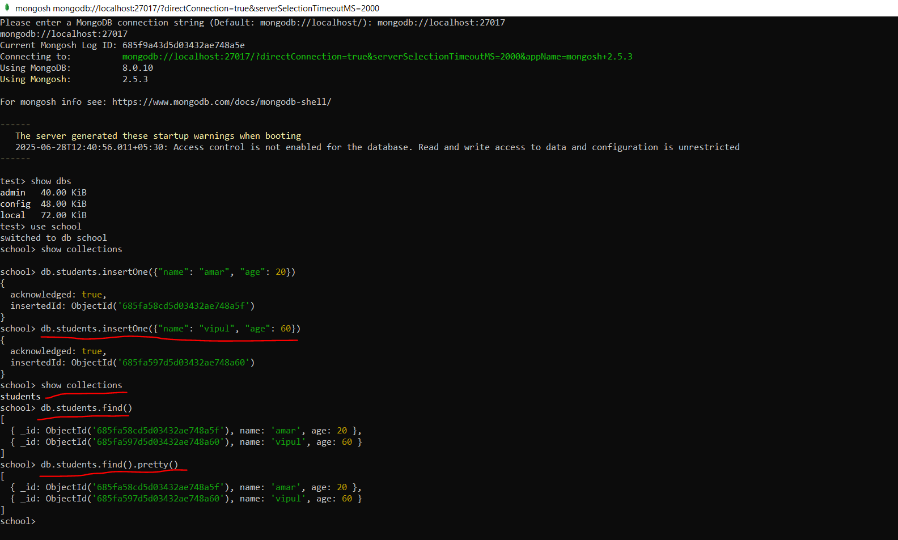
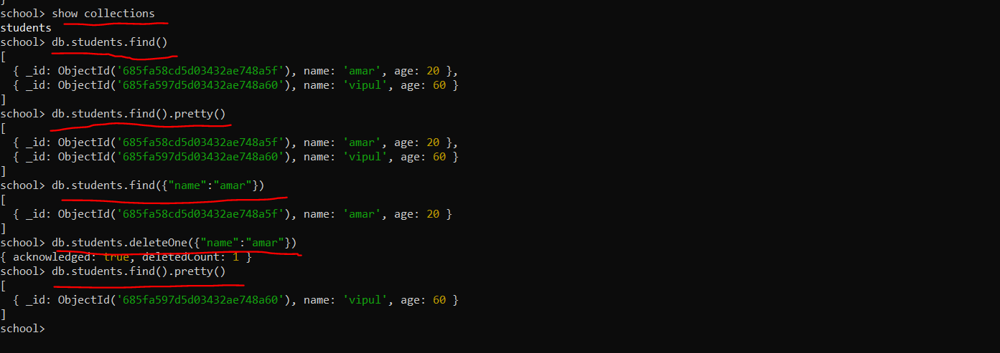

Install Mongo Compass and Mongo shell
======================================

MongoDB Community Server Download :-
-------------------------------------

https://www.google.com/search?q=mongodb+download&rlz=1C1GCEA_enIN1101IN1101&oq=mon&gs_lcrp=EgZjaHJvbWUqDggCEEUYJxg7GIAEGIoFMgYIABBFGDwyDggBEEUYJxg7GIAEGIoFMg4IAhBFGCcYOxiABBiKBTIGCAMQRRg5MgYIBBBFGDwyBggFEEUYPDIGCAYQRRg8MgYIBxBFGDzSAQgyNzE5ajFqN6gCALACAA&sourceid=chrome&ie=UTF-8&safe=active&ssui=on

package - msi (installer)

Test - type services >> MongoDB Server (MongoDB) >> running...

To Run MongoDB Query: - 
------------------------

Download MongoDB Shell

https://www.google.com/search?q=mongodb+shell+download&sca_esv=7502eedaa547c4dc&rlz=1C1GCEA_enIN1101IN1101&sxsrf=AE3TifOJu0dnd84qjM0pd6gXBjxsl9W1sg%3A1751095227215&ei=u5dfaIT2DOL5seMPn93j-QY&ved=0ahUKEwjEv_GHypOOAxXifGwGHZ_uOG8Q4dUDCBA&uact=5&oq=mongodb+shell+download&gs_lp=Egxnd3Mtd2l6LXNlcnAiFm1vbmdvZGIgc2hlbGwgZG93bmxvYWQyChAAGLADGNYEGEcyChAAGLADGNYEGEcyChAAGLADGNYEGEcyChAAGLADGNYEGEcyChAAGLADGNYEGEcyChAAGLADGNYEGEcyChAAGLADGNYEGEcyChAAGLADGNYEGEcyDRAAGIAEGLADGEMYigUyDRAAGIAEGLADGEMYigVI6BRQ2wRYrRBwAXgBkAEAmAEAoAEAqgEAuAEDyAEA-AEBmAIBoAIGmAMAiAYBkAYKkgcBMaAHALIHALgHAMIHAzItMcgHBA&sclient=gws-wiz-serp&safe=active&ssui=on

package - msi (installer)

select/create path mongosh - c://mongosh

Double click on c://mongosh.exe

connection string -  mongodb://localhost:27017

Overview of MONGO DB
====================

=> Mongodb is a Database.

=> How in Mysql Tables presents same in Mongodb Collection will be present.

=> In Mysql Inside a Table rows and columns presents same in Mongodb collections will be there and inside a collection
   fields present and a row called as a document.

=> Suppose In mysql there is a table called School and a row's like amar, vipul and telusko ...and a columns called name
   age and address....same In mongodb there is a collection name school inside that there are some fields, so in mysql
   columns and in mongodb fields. In mysql rows and in mongodb document like amar, vipul and telusko..

commands
========

+ Run mongosh

+ show dbs

+ use school   (automatically one school database will be created on the fly)

+ show collections  (currently nothing)

+ db.students.insertOne({})    
           -go inside school db, search for students collection which is not present so, it will create automatically
            and insert one document. In mysql how we are inserting a row same here inserting a json document.

+ school> db.students.insertOne({"name": "amar", "age": 20})
+ school> db.students.insertOne({"name": "vipul", "age": 60})
+ show collections
+ db.students.find()
+ db.students.find().pretty()

 

+ mongodb automatically generates Id. Id will be unique for mongodb. for each document id will be unique.

+ db.students.find({"name":"amar"})
+ db.students.deleteOne({"name":"amar"})

+ 

