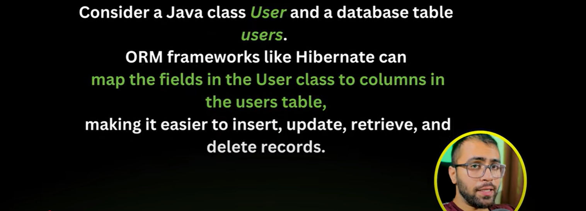
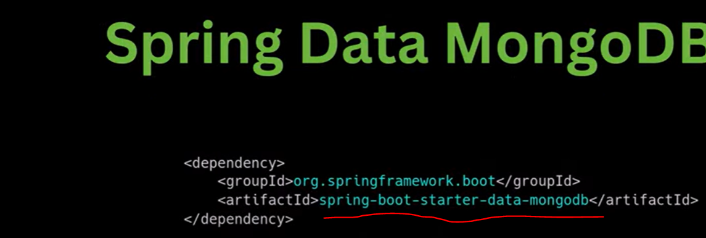
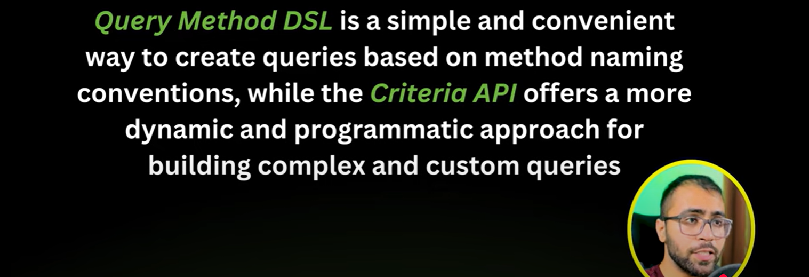

ORM - Object Relational Mapping
==================================

ORM is a Technique used to mapped Java Objects to Database Tables.

which means you will perform some operations on a class and automatically that operations will perform
inside a database tables.

what is JPA (Java Persistence API)
====================================

Persistence means permanently storing data.
API which means set of Rules.

JPA provides set of rules to achieve ORM. 

JPA is a way to achieve ORM, It includes Interfaces and annotations that you use in your Java classes
and requires a Persistence Provider(ORM tool) for Implementation.

JPA is not an Implementation, It is a set of Rules which is going to implement by a Persistence provider or ORM tools.

What is Persistence Provider/ ORM tools
=========================================

To use JPA, you need a persistence provider. A persistence provider is a specific implementation of the
JPA specification. Examples of JPA persistence providers include Hibernate, EclipseLink and OpenJPA. 
These providers implement the JPA interfaces and provide the underlying functionality to interact with databases,

In an Actual way you are using Hibernate to interact with database, you are using EclipseLink to interact with database,
you are using OpenJPA to interact with database.

Spring Data JPA
================

Spring Data JPA is build on top of the JPA(Java Persistence API) specification, but It is not a JPA implementation 
Itself. 
Instead It simplifies working with JPA by providing higher-level abstractions and utilities. 

However, to use Spring Data JPA effectively you still need a JPA implementation, such as Hibernate, EclipseLink
or another JPA-complaint provider, to handle the actual database interactions.

JPA is not used with MongoDB
=============================

JPA is primarily designed for working with relational databases, where data is stored in tables with a pre-defined 
schemas. MongoDB, on the other hand, is a NoSQL database that uses a different data model, typically based on collections
of documents, which are schema-less or have flexible schemas. This fundamental difference in data model and
storage structure is why JPA is not used with MongoDB.

In the case of MongoDB, you don't have a traditional JPA persistence provider. MongoDB is a NoSQL database,
and Spring Data MongoDB serves as the "persistence provider" for MongoDB. It provides the necessary abstractions
and implementations to work with MongoDB in a SPring Application.

Way's to Interact with Database
================================

a. Query Method DSL
b. Criteria API

Query Method DSL and Criteria API are 2 different ways to interact with a database when using Spring data JPA for 
relational databases and Spring Data MongoDB for MongoDB databases.

Spring Data JPA is a part of the Spring framework that simplifies data access in java applications, while Spring
Data MongoDB provides similar functionality for MongoDB.

