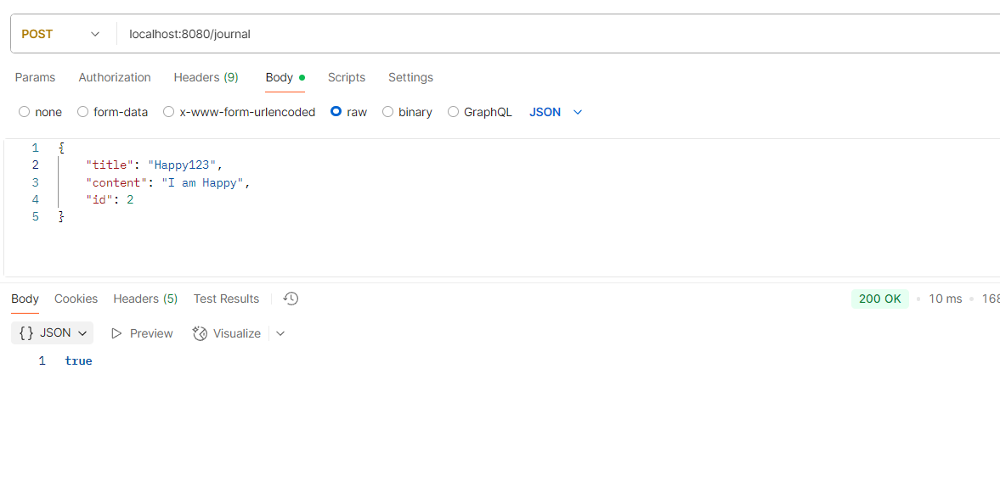

Postman Testing
==================

1. POST : Create Entry
----------------------

we can see Id automatically created as we not pass in our postman request. 

===>>  now let me pass Id from postman as 2

we can see flexibility. we are able to change the Id datatype every time. It converted 2 into String because
In our JournalEntry Entity we have given @Id as a String type. so default mongodb generated Id got mapped with 
@Id String Id value. because we have given @Id annotation. 
    So, In postman If you give Id then It will get saved as It is, But If you will not give then mongodb will
use their own data type ObjectId for Id.

===>> let me add same entry with Id : 2, let's see what will happen.

we can see It's not get added.

===>> let me update/do some changes other than Id, let's see what will happen.

we can see id:2 record got updated. so when Id same then new document won't add it will update that specific document.

----------------------------------------------------------------------------------------
*** let's delete all entries from database and change Id as a String given to ObjectId.

we should not add date manually while sending request from postman it should automatically come bcz we are
going to set LocalDateTime.now()

----------------------------------------------------------------------------------------

2. GET : Fetch Journal Entries
------------------------------

3. GET : Fetch Journal Entry By Id
-----------------------------------

4. PUT : Update By Id
---------------------

5. DELETE : Delete By Id
-------------------------

Testing
=========

In DB 2 documents

