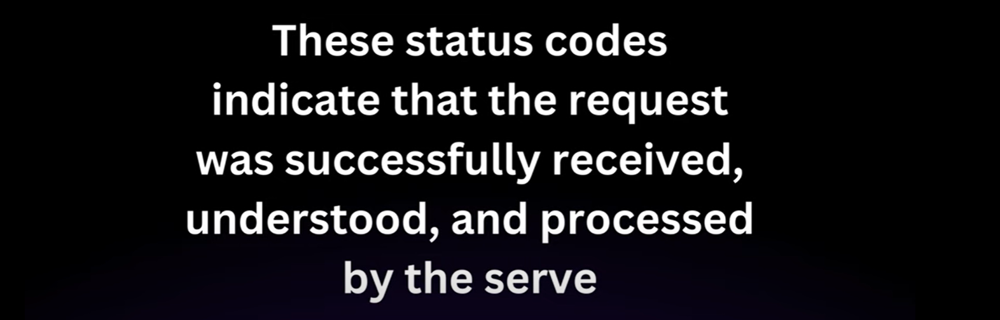

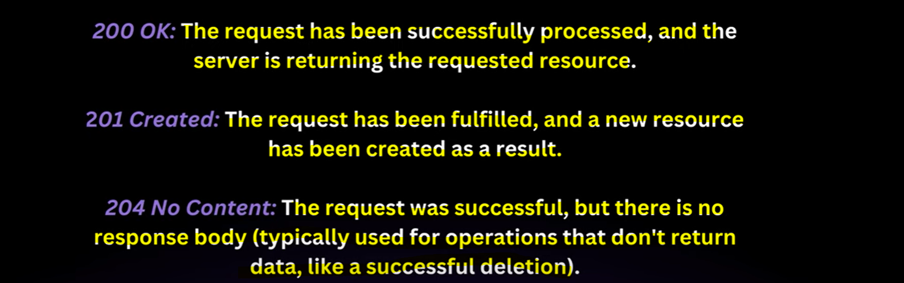

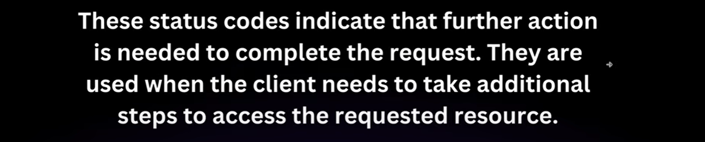

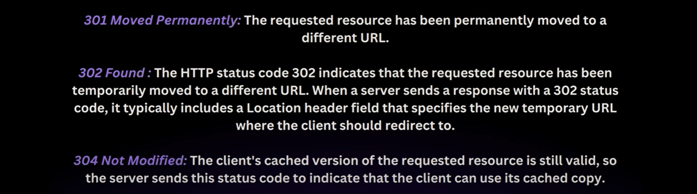

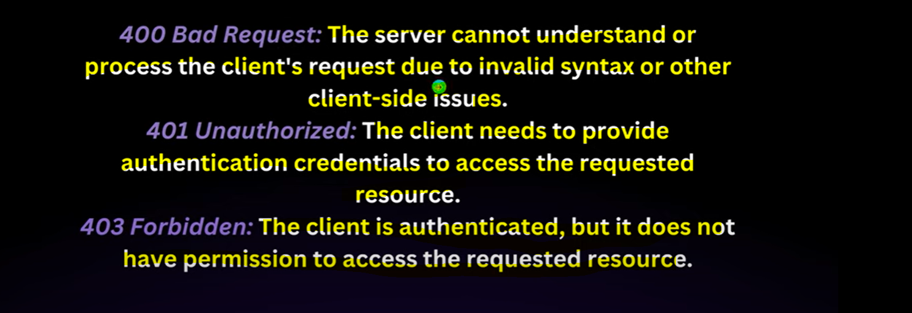

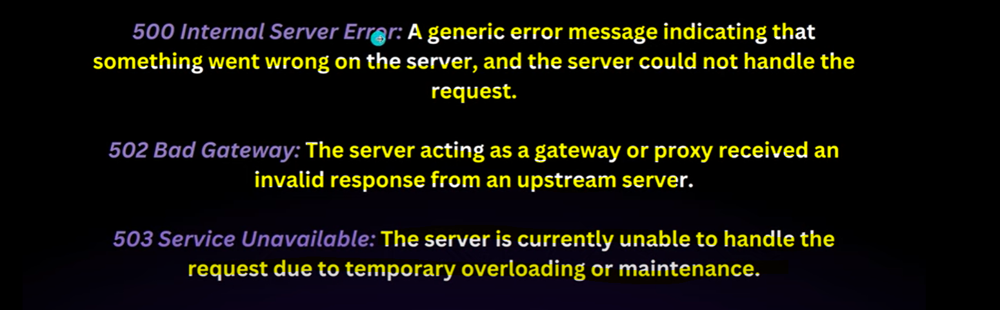

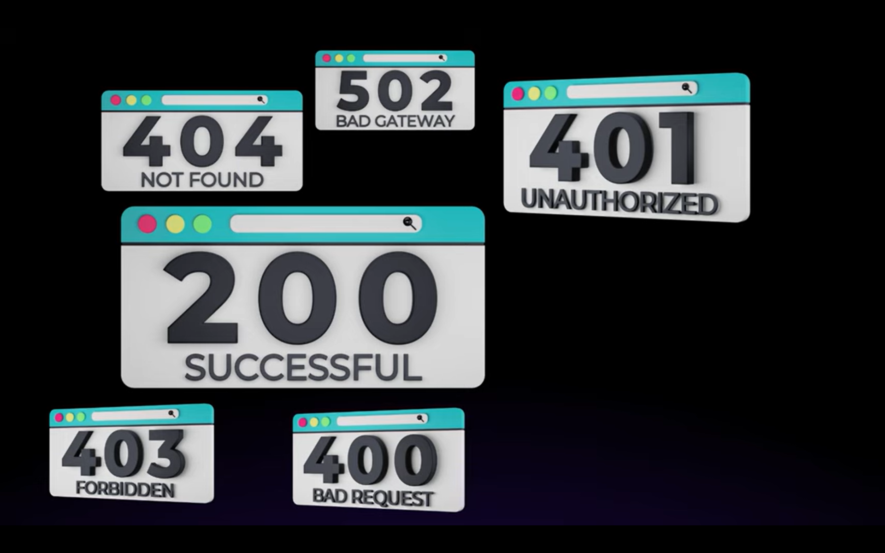

WE CAN ACHIEVE SENDING a STATUS CODE WITH HELP oF RESPONSE ENTITY

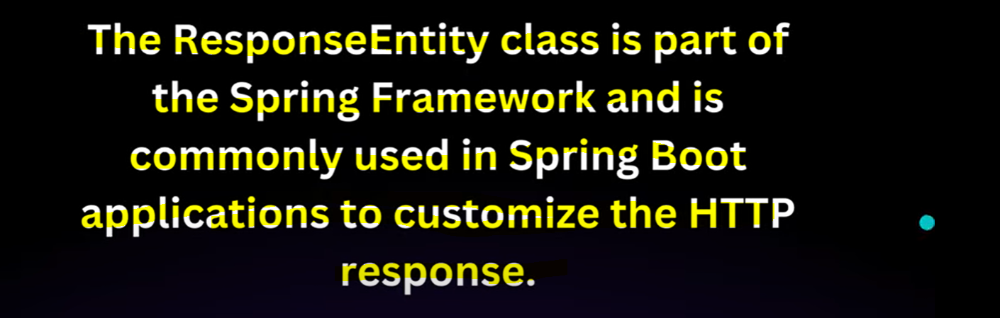

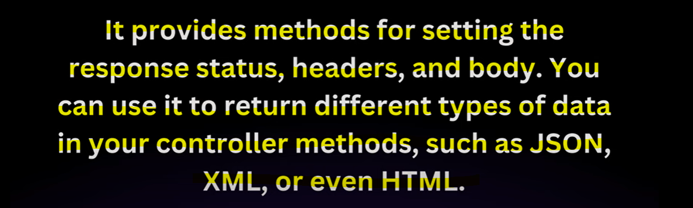

Code Change Explanation
========================

------------------------
1 - getJournalEntryById
------------------------
Earlier
-------
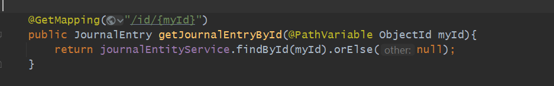
After ResponseEntity Addition
------------------------------

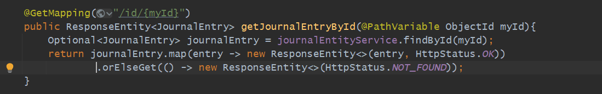
earlier it was showing 200:OK If data found and not found.. but now if found 200 if not found 404
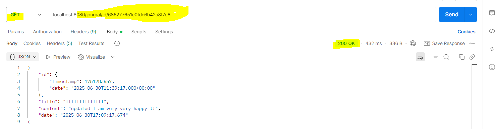
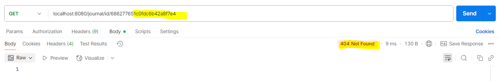

------------------------
2 - create Journal Entry
------------------------
Earlier
-------
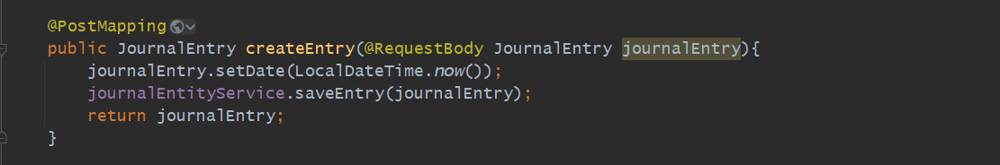
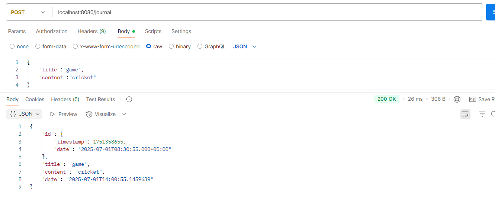
earlier it was showing 200:OK If entry created successfully But Now If created 201 If not Bad Request
After ResponseEntity Addition
------------------------------
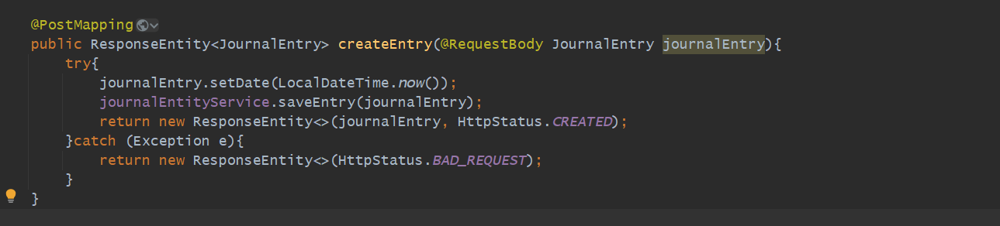
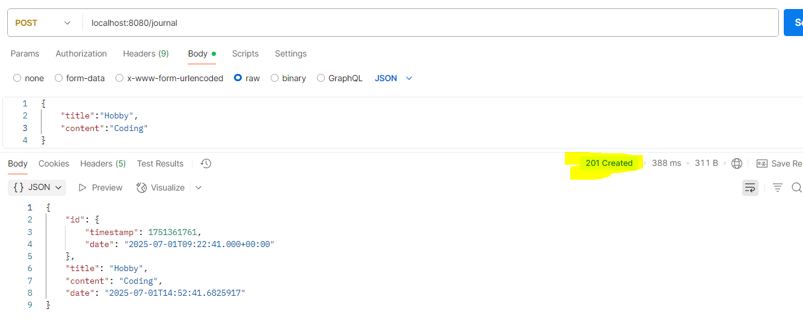
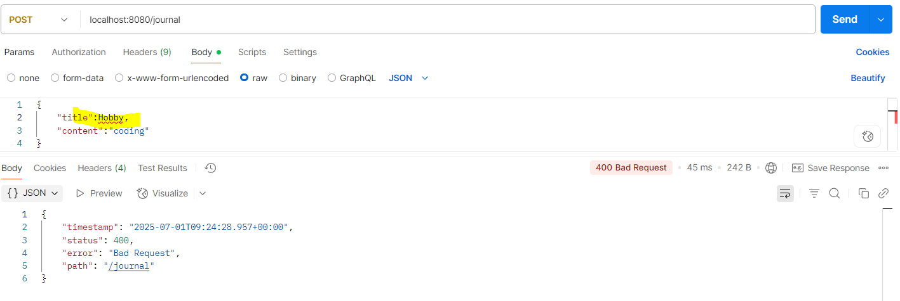

------------------------
3 - Delete
------------------------
Earlier
-------
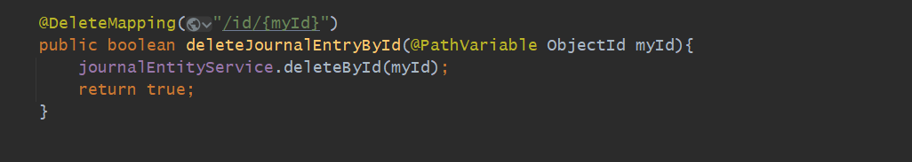
After ResponseEntity Addition
------------------------------
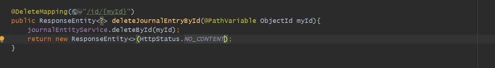
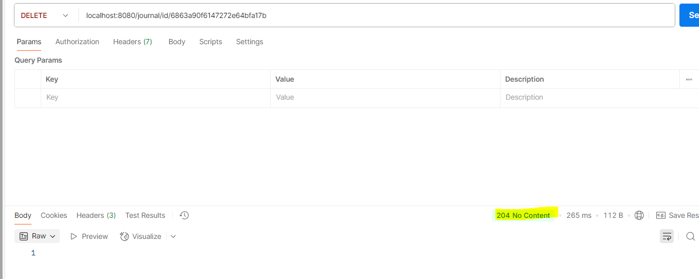

